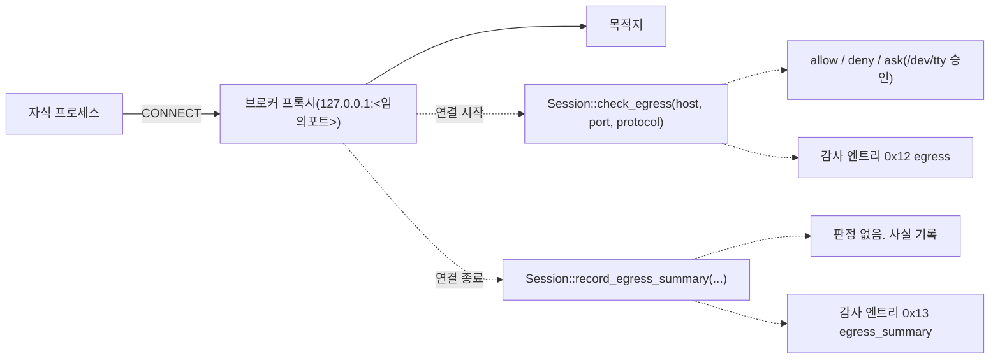

# egress 프록시 층 규격 (airlock.proxy.v1)

`docs/design.md` 6장 MVP 6번의 정본 규격입니다. 호스트 단위 egress 정책을 실제로 강제하는 층을 정의합니다.

## 1. 설계 원칙

1. **프록시는 강제 장치가 아닙니다.**
   - 강제력은 커널 층이 "밖으로 나가는 유일한 길"을 프록시로 만드는 데서 나옵니다. 프록시만 띄우고 커널이 직접 아웃바운드를 열어 두면 에이전트는 프록시를 무시하면 그만입니다.
2. **fail-closed**
   - 프록시 설정을 무시하는 클라이언트는 우회하는 것이 아니라 연결에 실패해야 합니다.
3. **판정은 한 곳에서만 합니다.**
   - 프록시는 정책 엔진을 새로 구현하지 않고 `Session`의 기존 평가·승인·감사 경로를 그대로 부릅니다. 두 번째 판정 지점을 만들면 두 지점이 갈라집니다.
4. **v1은 TLS를 종단하지 않습니다.**
   - CONNECT의 호스트명까지만 봅니다. MITM은 로컬 CA 주입이 필요하고 그 자체가 공격 표면이므로(`design.md` 11장) DLP와 함께 후속 버전으로 미룹니다.
5. **프록시도 TCB입니다.**
    - 자식이 보낸 바이트를 파싱하는 코드이므로 신뢰 경계 안입니다. 외부 의존성 없이 표준 라이브러리로만 작성합니다.

## 2. 구조



- 브로커가 `127.0.0.1:0`에 바인드해 커널이 준 포트를 얻습니다. 포트를 고정하지 않는 이유는 두 세션이 동시에 뜰 때 충돌하고, 고정 포트는 같은 사용자의 다른 프로세스가 선점해 가로챌 수 있기 때문입니다.
- 자식 환경에 `HTTP_PROXY`, `HTTPS_PROXY`, `http_proxy`, `https_proxy`, `ALL_PROXY`를 주입합니다. `NO_PROXY`는 **빈 값으로 덮어씁니다.** 상속된 `NO_PROXY`가 남아 있으면 거기 적힌 호스트가 프록시를 건너뛰고, 커널 층이 그 연결을 막아 원인을 알기 어려운 실패가 됩니다.
- 프록시는 자식이 전부 종료할 때까지 살아 있고, 세션 종료와 함께 리스너를 닫습니다.

## 3. 프로토콜

v1이 받는 요청은 두 형태뿐입니다.

### 3.1 CONNECT (터널)

```
CONNECT api.anthropic.com:443 HTTP/1.1
Host: api.anthropic.com:443
```

- 대상은 `host:port` 형태여야 합니다. 포트 생략은 거부합니다(`400`). 기본 포트를 추측하면 정책이 판정한 포트와 실제 연결 포트가 갈라집니다.
- 판정이 allow면 `200 Connection established`를 보내고 양방향 바이트 릴레이로 넘어갑니다. 릴레이 이후의 바이트는 해석하지 않습니다.
- 판정이 deny면 `403`, ask 거절도 `403`입니다. 승인 대기 중에는 응답을 보내지 않습니다.
- 프로토콜 태그는 `Tls`입니다. **`Tls`는 "암호화되었다"는 뜻이 아니라 "프록시가 본문을 읽지 않았다"는 뜻입니다.** v1은 터널을 종단하지 않으므로 안에 무엇이 흐르는지 알지 못하며, 자식이 CONNECT 터널 안에서 평문을 보내도 이 층은 구분하지 못합니다. 태그가 관측한 사실보다 강한 주장을 하지 않도록 이 구분을 문서와 감사 뷰어 양쪽에서 유지합니다.

### 3.2 absolute-form HTTP (평문)

```
GET http://example.com/path HTTP/1.1
```

- 요청 라인의 절대 URL에서 호스트와 포트를 뽑아 판정합니다. 포트 생략 시 80입니다.
- allow면 origin-form(`GET /path HTTP/1.1`)으로 고쳐 목적지에 전달하고 응답을 그대로 돌려줍니다.
- 프로토콜 태그는 `Http`입니다. 프록시가 요청 라인을 실제로 읽었으므로 이것은 관측된 사실입니다.
- **`Http` 태그가 붙은 요청은 정책 계층의 평문 바닥을 한 번 더 지납니다** (`policy-dsl.md` 8.2절). 호스트만 적은 `allow` 규칙은 평문까지 열지 않으므로, `[defaults].egress_plaintext`가 `deny`인 정책에서는 허용된 호스트로 가는 평문 요청도 `403`이 됩니다. 그때 감사 엔트리의 `rule`은 합성 규칙 `airlock:egress-plaintext`이며 원래 매칭된 규칙의 id가 매칭 표기 안에 남습니다.
- 프록시에는 평문 거부가 하드코딩되어 있지 않습니다. 판정 지점은 정책 엔진 하나이며 프록시는 결론만 받습니다. 두 번째 판정 지점을 두면 두 지점이 갈라지고, 갈라지는 순간 감사 로그가 거짓 보증을 합니다(1절 3번).
- 평문 HTTP는 전체 URL이 보이므로 감사 가치가 CONNECT보다 큽니다. 후속 DLP 층이 붙는 지점도 여기입니다.

### 3.3 거부하는 것

헤드 파서는 규격에서 조금이라도 벗어나면 받지 않습니다. 애매하게 받아 주는 파서는 프록시가 판정한 목적지와 업스트림이 보는 목적지를 갈라놓기 때문입니다. 거부된 요청은 판정에 닿지 않고, 업스트림 연결을 열지 않으며, 결과 엔트리를 남기지 않습니다. CONNECT 의 헤더는 목적지로 넘기지 않지만 형태 검사는 평문 요청과 똑같이 받습니다.

`400`이며 연결을 닫는 것입니다.

- origin-form 요청(`GET /path`). 프록시로 온 요청인데 목적지가 없으므로 판정 대상을 특정할 수 없습니다.
- CRLF 쌍의 일부가 아닌 CR 이나 LF. `X-A: x<LF>Host: evil.example` 처럼 값 안에 숨은 LF 는 CRLF 로만 자르는 파서를 지나 업스트림에서 두 번째 Host 가 됩니다. 요청 라인과 헤더 어디에 있든 거부합니다.
- 요청 라인이나 헤더 이름과 값에 든 제어 문자(0x00-0x1F, 0x7F). 헤더 값 안의 HTAB 만 예외이고 request-target 에서는 HTAB 도 거부합니다. 요청 라인에서 HTAB 를 공백으로 읽는 서버가 있어 목적지가 어디서 끝나는지가 갈립니다.
- obs-fold(SP 나 HTAB 로 시작하는 줄), 헤더 이름과 콜론 사이의 공백, RFC 9110 token 이 아닌 헤더 이름.
- Host 헤더가 둘 이상인 헤드. 평문 요청의 Host 는 어차피 판정한 authority 로 다시 쓰지만, 무엇을 받는지의 기준이 요청 종류마다 달라지면 그 차이가 곧 앞뒤 서버의 해석 차이가 됩니다.
- `HTTP/1.0` 과 `HTTP/1.1` 외의 버전. 버전 문자열을 그대로 재방출하므로 `HTTP/1.x` 같은 형태를 통과시키지 않습니다.
- 비ASCII, 공백, 구분자가 든 호스트. 허용 문자는 ASCII 영숫자와 `-` `.` `_` 와 대괄호 안 v6 리터럴의 `:` 뿐입니다. 프록시는 호스트를 정규화하지 않으며, 판정에 쓰는 호스트와 실제 접속과 감사 기록에 쓰는 호스트는 같은 문자열 하나입니다.
- 빈 줄 하나로 끝나지 않는 헤드. 읽기 층이 첫 `CRLF CRLF` 에서 끊으므로 파서도 같은 경계를 요구합니다. 그 사이에 빈 줄이 더 있으면 두 층이 다른 헤드를 보게 됩니다.
- userinfo(`user@host`)가 든 authority, 대괄호 없는 v6 리터럴, 포트 0 과 범위 밖 포트와 숫자가 아닌 포트, CONNECT 의 포트 생략.

그 외입니다.

- 요청 라인 8KiB 초과, 헤더 총합 64KiB 초과. `431`입니다.
- 프록시 자신의 주소로 향하는 CONNECT. 무한 루프를 막습니다. 판정 뒤 이름 해석 단계에서 걸러지며 `502`입니다.

## 4. 판정과 감사

- 호스트는 프록시가 요청 라인에서 읽은 **문자열 그대로** 정책에 넘깁니다. 정규화는 정책 엔진의 몫입니다(`policy-dsl.md` 8절).
- 이름 해석은 판정 **이후에** 프록시가 수행합니다. 판정 전에 해석하면 deny될 호스트의 DNS 질의가 이미 나가서, 이름 자체가 반출 채널이 됩니다.
- 이름 해석 결과가 여러 IP면 순서대로 시도하고, 전부 실패하면 `502`입니다. 해석된 IP는 v1에서 다시 판정하지 않습니다. 호스트명 규칙과 IP 규칙을 잇는 개념이 정책 엔진에 없기 때문입니다(`limitations.md` 6.4). 그 결과 DNS 리바인딩은 v1에서 막히지 않습니다.
- 감사 엔트리는 `0x12 egress` 하나이며 호스트명과 포트와 프로토콜 태그를 담습니다. 지금까지 방출된 적 없던 `Tls`와 `Http` 태그를 이 층이 처음으로 씁니다(`audit-format.md` 6.3).
- **프로토콜 태그를 방출하는 층은 이 프록시뿐입니다.** seccomp 중계 층은 `connect(2)`만 보므로 모든 연결을 `Tcp`로 보고하고(`limitations.md` 5.12), `Tcp`는 "평문이다"가 아니라 "관측 층이 모른다"는 뜻입니다. 곧 `--egress-proxy` 없이 도는 세션에서는 `protocol` 조건 규칙이 아무것도 매칭하지 않고 평문 바닥도 발동하지 않습니다. **정책이 평문을 막는다는 보증은 이 층 위에서만 성립하며** 그 사실은 `airlock run` 배너의 한계 목록에 그대로 나옵니다.
- 프록시 경로의 감사 엔트리는 `actor`가 `airlock:unknown-peer`입니다. 프록시는 연결의 peer pid를 알지 못하므로 브로커 자신으로도, 관측된 pid로도 적지 않습니다. peer pid 조회는 후속입니다.

### 4.1 결과 기록

연결이 끝나면 프록시가 방향별 바이트와 지속 시간을 게이트의 완료 훅으로 넘기고, 브로커가 그것을 `0x13 egress_summary` 엔트리로 남깁니다. `egress`가 "어디로 나가려 했고 무엇으로 판정했는가"라면 `egress_summary`는 "그래서 실제로 얼마나 나갔는가"입니다.

- **판정이 아니라 사실 기록입니다.** 완료 훅은 정책을 다시 평가하지 않습니다. `decision`은 스키마 때문에 `allow`이고 `rule`은 예약 id `airlock:egress-summary`입니다.
- 바이트는 프록시가 실제로 중계한 페이로드입니다. 평문 요청의 헤드와 헤드 뒤에 딸려 온 바이트도 목적지로 나간 바이트이므로 반출에 포함합니다. TLS 레코드 오버헤드를 뺀 값이 아닙니다.
- 목적지에 **완전히 써 넣은 조각만** 셉니다. `write_all`이 도중에 실패하면 몇 바이트가 나갔는지 알 방법이 없으므로 그 조각은 세지 않습니다. 곧 이 값은 하한이며 오차는 조각 하나(16KiB)를 넘지 않습니다.
- `io::copy`를 쓰지 않는 이유는 실패로 끝난 복사가 바이트 수를 통째로 버리기 때문입니다. RST로 끊긴 연결이 "0 바이트 반출"로 보고되면 그것이 정확히 반출 탐지의 구멍이 됩니다.
- **방향별 바이트를 세지 못한 연결에는 훅을 부르지 않습니다.** 업로드 방향은 별도 스레드에서 세므로 그 스레드를 띄우지 못했거나 `join`에 실패하면 반출량을 모릅니다. 0은 "아무것도 나가지 않았다"는 사실 주장이라, 모르는 것을 0으로 남기면 감사 로그가 거짓 보증을 합니다. 그 대신 허용된 `egress` 엔트리 수와 `egress_summary` 수의 차이가 "결과를 모르는 연결"로 드러나며 `airlock audit report`가 그 수를 따로 보여 줍니다.
- 거부된 목적지와 연결하지 못한 목적지에는 훅을 부르지 않습니다. 나가지 않은 연결에 0 바이트 결과를 남기면 "시도했으나 아무것도 안 나갔다"는 없는 사실이 로그에 생깁니다.
- 세션이 닫힌 뒤에 도착한 결과는 기록되지 않고 경고로만 나갑니다. `session_end` 뒤에 붙는 엔트리는 체인을 앵커보다 길게 만들어 세션 전체를 "종료 후 덧붙이기"로 보고하게 합니다(`audit-format.md` 8.3). 브로커는 세션을 닫기 전에 살아 있는 중계 연결이 끝나기를 최대 2초 기다립니다.
- 누적 반출량은 이 시점에 갱신되며 `max_bytes_out` 판정의 입력이 됩니다(`policy-dsl.md` 8.4절). 곧 한도는 **다음 연결부터** 걸립니다.

**이 이벤트는 프록시 층 전용입니다.** seccomp 중계 층은 `connect(2)`만 보고 그 뒤로 오가는 바이트를 보지 못하므로 결과를 만들 수 없습니다. `--egress-proxy` 없이 도는 세션에는 `egress_summary`가 하나도 없으며 그 세션의 반출량은 **전혀 알 수 없습니다.** 엔트리가 없는 것을 "아무것도 나가지 않았다"로 읽으면 안 됩니다.

### 4.2 중계 층과의 이중 기록

Linux에서 seccomp 중계 층이 켜져 있으면 같은 연결에 대해 엔트리가 두 개 남습니다.

| 층            | 보는 것             | 남기는 것                |
|---------------|---------------------|--------------------------|
| seccomp 중계  | 자식의 `connect(2)` | `127.0.0.1:<프록시포트>` |
| egress 프록시 | CONNECT 요청 라인   | `api.anthropic.com:443`  |

중계 층 엔트리는 "자식이 프록시로 갔다"는 사실의 증거이고, 실제 목적지는 프록시 엔트리에만 있습니다. 둘을 합쳐야 경로 전체가 복원됩니다. 중계 층 엔트리를 지우지 않는 이유는, 그것이 없으면 프록시를 거치지 않은 연결 시도와 구분되지 않기 때문입니다.

## 5. 내용 검사기가 붙을 자리

v1은 릴레이 구간에서 내용을 해석하지 않습니다. 그 다음 단계가 붙을 자리를 미리 표시해 둡니다.

자리는 릴레이의 조각 단위 복사 루프 안, **읽기와 쓰기 사이**입니다. 타입 경계는 `Direction`(`Outbound` / `Inbound`)이며 조각 하나와 그 방향을 받아 통과·차단을 정하는 형태입니다. 차단이면 그 자리에서 루프를 끊고 연결을 닫습니다.

거기 붙을 것.

- **TLS 종단과 시크릿 패턴 차단.** 별표 7 3번이 요구하는 탐지가 여기서만 성립합니다. CONNECT 터널을 열어 두는 한 조각은 암호문이고, 그것을 읽으려면 프록시가 인증서를 발급해 자식에게 신뢰시켜야 하며 그 결정은 이 층 밖입니다(`design.md` 11장).
- **연결 도중 총량 차단.** `max_bytes_out`이 지금은 다음 연결부터 막지만(`policy-dsl.md` 8.4절), 스트림을 세면서 한도에서 자르려면 같은 자리가 필요합니다.
- **같은 훅의 파일 경로.** `--mediate full`의 파일 open 경로에 같은 축이 붙습니다. 별표 7 1번과 14번(악성코드 진단)의 유일한 실현 경로가 그것입니다.

구현은 v1에 없습니다. 자리와 타입만 있고 조각은 손대지 않은 채 그대로 나갑니다.

## 6. 플랫폼 결합

프록시가 유일한 출구가 되게 만드는 부분입니다. 이것이 없으면 프록시는 그냥 편의 기능입니다.

### 6.1 macOS (Seatbelt)

egress 프록시가 켜지면 프로파일의 아웃바운드 규칙을 루프백 한정으로 좁힙니다.

```
(deny network-outbound)
(allow network-outbound (remote ip "localhost:<프록시포트>"))
(allow network-outbound (remote unix))
```

Darwin 25.4(macOS 26.4) arm64에서 동작을 확인했습니다. 허용 포트는 연결되고, 같은 루프백의 다른 포트와 외부 IP는 커널이 거부합니다. `localhost:<포트>`는 IPv4와 IPv6 루프백 양쪽에 매칭합니다.

이 결합이 지금까지의 "egress allow가 하나라도 있으면 아웃바운드를 통째로 연다"는 한계(`limitations.md` 4장)를 macOS에서 해소합니다.

### 6.2 Linux (현재는 Landlock 포트 축소, netns는 후속)

**현재 구현.** Landlock의 TCP 포트 허용 목록이 프록시 포트 하나로 줄어듭니다. 정책의 포트 목록은 이제 프록시가 대신 나가므로 자식에게 열지 않습니다.

이것만으로는 프록시가 유일한 출구가 되지 않습니다. Landlock은 포트까지만 보고 목적지 IP를 보지 못하므로, 자식이 자기 환경에 적힌 프록시 포트를 그대로 써서 외부 호스트에 직접 연결하면 프록시를 건너뜁니다. 이 잔여 구멍은 enforcer gap으로 배너에 노출합니다. **곧 Linux에서 `--egress-proxy`는 macOS와 달리 아직 fail-closed가 아닙니다.**

**후속.** 자식을 `CLONE_NEWUSER | CLONE_NEWNET`로 새 네트워크 네임스페이스에 넣으면 그 안에는 루프백뿐이라 외부로 나갈 경로 자체가 사라집니다. 소켓은 생성 시점의 netns에 묶이므로 브로커가 자식 netns 안에서 리스너를 만들고 accept 루프는 호스트 쪽에서 돕니다. 이 단계가 들어와야 Linux도 macOS와 같은 경계를 갖고, 6.1의 DNS 구멍까지 함께 닫힙니다.

### 6.3 결합 실패 시

플랫폼 결합에 실패하면 프록시만 띄운 채 계속 진행하지 않습니다. 강제를 관측으로 조용히 바꾸는 것은 `design.md` 9.3이 금지한 격하입니다. 실행을 중단하거나, 사용자가 `--observe`로 명시한 경우에만 gap으로 노출하고 진행합니다.

## 7. v1이 막지 못하는 것

프록시 층이 들어와도 남는 것들입니다. 배너와 `limitations.md`에 그대로 노출합니다.

- **DNS 반출 (macOS).** 자식의 이름 해석은 mDNSResponder를 거치며 이 경로는 `network-outbound`가 아닙니다. `mach-lookup` deny로도 막히지 않는 것을 확인했습니다. 곧 자식은 `<유출데이터>.attacker.com` 질의로 데이터를 내보낼 수 있습니다. netns가 들어오는 Linux 후속 단계에서는 이 경로가 함께 끊깁니다.
- **프록시 우회 (Linux).** 6.2대로 현재 Linux 백엔드는 포트까지만 강제하므로 자식이 프록시 포트로 외부에 직접 연결할 수 있습니다. netns가 들어오기 전까지 Linux의 `--egress-proxy`는 강제가 아니라 관측에 가깝습니다.
- **DNS 리바인딩.** 4절대로 해석된 IP를 재판정하지 않습니다.
- **CONNECT 대상이 IP 리터럴인 경우.** 호스트 패턴 규칙은 IP에 매칭하지 않으므로(`policy-dsl.md` 8절) `[defaults].egress`로 떨어집니다. 기본값이 deny면 막히지만, 호스트 allowlist를 통과하는 것은 아닙니다.
- **터널 내용.** v1은 TLS를 종단하지 않으므로 허용된 호스트로 무엇을 보내는지 보지 못합니다. 얼마나 보냈는지는 4.1절대로 셀 수 있지만 무엇을 보냈는지는 모릅니다. 그래서 `Tls` 태그는 암호화의 증거가 아니며, CONNECT 터널 안으로 평문을 흘려보내는 경로는 평문 바닥에 걸리지 않습니다. DLP는 후속입니다.
- **프록시를 쓰지 않는 프로토콜.** SSH, 임의 TCP 등은 프록시 어휘에 없습니다. 커널 층이 막으므로 반출은 되지 않지만, 그 도구들은 프록시 모드에서 동작하지 않습니다.

## 8. 테스트 의무

- CONNECT와 absolute-form 파싱. 정상 형태, 포트 생략, 개행 삽입, 과대 길이, origin-form.
- 판정 결과별 응답 코드와 릴레이 진입 여부.
- 프록시 자기 주소로의 CONNECT가 거부되는지.
- 판정이 deny일 때 이름 해석이 일어나지 않는지.
- 플랫폼 결합이 실패했을 때 진행하지 않는지.
- 생성된 Seatbelt 프로파일이 프록시 모드에서 전면 허용 규칙을 방출하지 않는지.
- 허용된 호스트로 가는 평문 요청이 `[defaults].egress_plaintext` 바닥에 걸려 `403`이 되는지, 그리고 그 판정이 프록시가 아니라 정책 엔진에서 나오는지.
- 루프백 에코 목적지로 실측해 `egress_summary`의 방향별 바이트가 실제 전송량과 같은지.
- 평문 요청의 헤드가 반출 바이트에 들어가는지.
- 거부된 목적지와 연결하지 못한 목적지에 결과 엔트리가 남지 않는지.
- 닫힌 세션이 늦게 도착한 결과를 거부하고, 그래도 앵커와 체인이 어긋나지 않는지.
